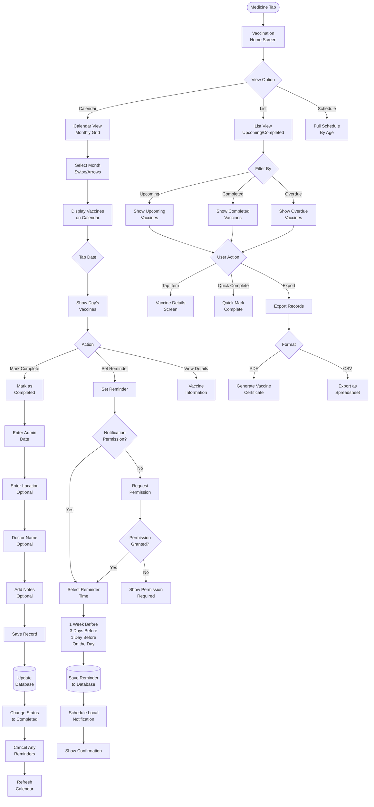
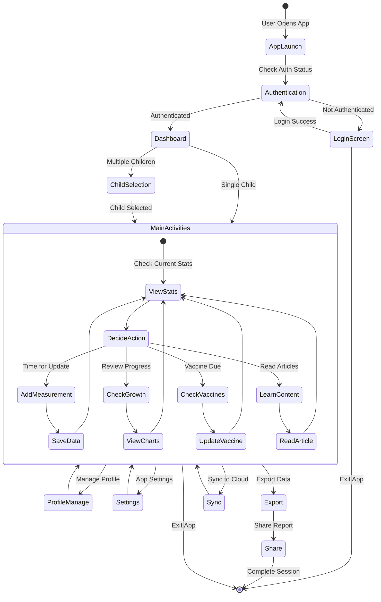
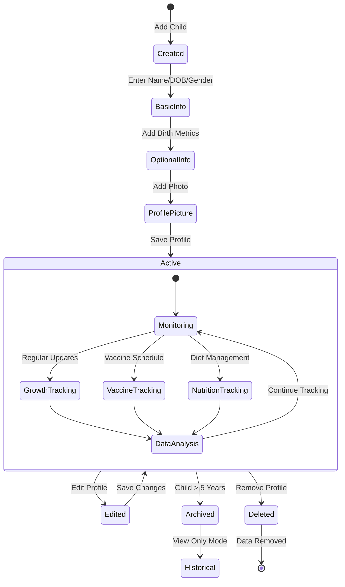
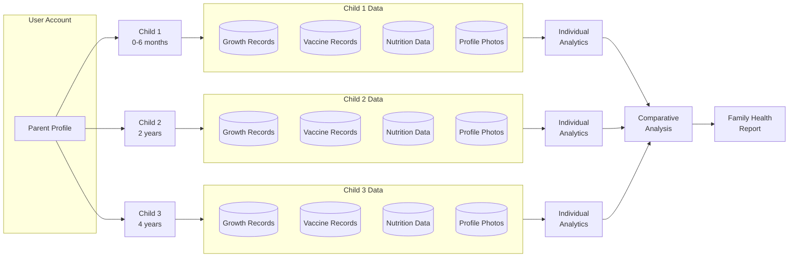
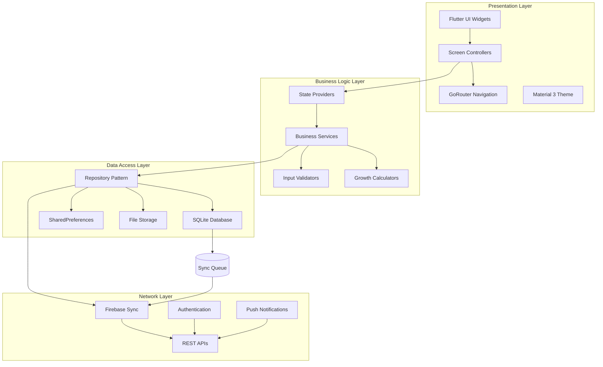

# 📱 Aayu (ආයු) - Complete User Guide

> **Your Child's Nutrition & Growth Companion**  
> A comprehensive guide to using Aayu for tracking your child's health, growth, and nutritional journey

## Table of Contents

1. [Welcome to Aayu](#welcome-to-aayu)
2. [Getting Started](#getting-started)
3. [Initial Setup](#initial-setup)
4. [Main Features](#main-features)
5. [Navigation Guide](#navigation-guide)
6. [Feature Details](#feature-details)
7. [Advanced Features](#advanced-features)
8. [Troubleshooting](#troubleshooting)
9. [FAQs](#faqs)
10. [Support & Contact](#support--contact)

---

## 🎯 Welcome to Aayu

### What is Aayu?

**Aayu (ආයු)** is a specialized child nutrition and growth tracking application designed specifically for Sri Lankan families. The app helps parents monitor their children's development from birth to 5 years, providing culturally relevant guidance and WHO-standard growth tracking.

### Key Benefits

- **📊 Growth Tracking**: Monitor weight, height, and BMI against WHO standards
- **💉 Vaccination Management**: Never miss an immunization appointment
- **🥗 Nutrition Guidance**: Get age-appropriate nutrition recommendations
- **🌐 Multilingual Support**: Available in English, Sinhala (සිංහල), and Tamil (தமிழ்)
- **📱 Offline-First**: Works without internet, syncs when connected
- **🔒 Privacy-Focused**: Your data stays secure and private

### Who Should Use Aayu?

- Parents with children aged 0-5 years
- Healthcare providers monitoring child growth
- Caregivers tracking multiple children
- Families seeking nutrition guidance

---

## 🚀 Getting Started

### System Requirements

#### Android
- Android 5.0 (API level 21) or higher
- At least 100MB free storage
- Camera access for profile pictures (optional)

#### iOS
- iOS 12.0 or later
- iPhone, iPad, or iPod touch
- At least 100MB free storage

### Installation

1. **Download the App**
   - Android: Visit Google Play Store and search "Aayu Sri Lanka"
   - iOS: Visit Apple App Store and search "Aayu"
   
2. **Install & Open**
   - Tap "Install" and wait for download
   - Open the app from your home screen

3. **Grant Permissions** (Optional)
   - Camera: For taking profile pictures
   - Storage: For saving profile images
   - Notifications: For vaccination reminders

---

## 🎬 Initial Setup

### 1. Language Selection

When you first open Aayu, you'll see the **Language Selection Screen**:

- **English** - International language
- **සිංහල** - Sinhala interface
- **தமிழ்** - Tamil interface

> 💡 **Tip**: You can change the language anytime from Settings

### 2. Onboarding Tour

The app will guide you through its main features:

1. **Welcome Screen** - Introduction to Aayu
2. **Growth Tracking** - Learn about monitoring development
3. **Vaccination Calendar** - Understanding immunization tracking
4. **Nutrition Guide** - Discover meal planning features

> You can skip the tour if you're familiar with the app

### 3. Account Registration

#### Creating Your Account

**Step 1: Choose Registration Method**
- Email registration
- Phone number registration

**Step 2: Enter Your Details**
- Full Name (required)
- Email Address (if email method)
- Phone Number (required for phone method)
- Password (minimum 8 characters)

**Step 3: Verify Your Account**
- For email: Click verification link sent to your email
- For phone: Enter 6-digit OTP sent via SMS

**Step 4: Complete Profile**
- Add profile picture (optional)
- Set notification preferences
- Configure units (Metric/Imperial)

#### Login for Existing Users

1. Tap "Already have an account? Login"
2. Enter your email/phone and password
3. Tap "Login"
4. Use "Forgot Password?" if needed

### 4. Adding Your First Child

After registration, you'll be prompted to add your child:

**Required Information:**
- Child's name
- Date of birth
- Gender (Male/Female)

**Optional Information:**
- Birth weight (kg/lbs)
- Birth height (cm/inches)
- Profile picture
- Medical notes

> 📝 **Note**: You can add multiple children and switch between profiles

---

## 🏠 Main Features

### Dashboard Overview

The home screen provides a comprehensive view of your child's health:

#### Child Selector
- **Profile Pills**: Quick switch between multiple children
- **Add Child Button**: Register additional children
- Shows current selected child's name and age

#### Child Information Card
Displays:
- Child's profile picture or initial
- Name and exact age (years, months, days)
- Current weight, height, and BMI
- Nutritional status indicator

#### Quick Actions Grid

For children **under 6 months**:
1. **Growth Countdown** (First Priority)
   - Track daily progress to 6-month milestone
   - View days completed and remaining
   - Access tips for infant care

2. **Add Measurement**
   - Record weight and height
   - Auto-calculate BMI
   - Add measurement notes

3. **Growth Charts**
   - View WHO standard curves
   - Track progress over time
   - Compare with percentiles

4. **Vaccines**
   - Check upcoming vaccines
   - Mark completed immunizations
   - Set reminders

For children **over 6 months**:
- Standard grid without Growth Countdown
- Focus shifts to regular tracking

#### Recent Activity Timeline
- Shows last 5 actions
- Includes timestamps
- Quick access to details

---

## 🧭 Navigation Guide

### Bottom Navigation Bar

Aayu uses a 5-tab navigation system:

#### 1. **Home** 🏠
- Dashboard overview
- Quick actions
- Child selector
- Recent activities

#### 2. **Growth** 📈
- Growth charts (Weight, Height, BMI)
- Percentile tracking
- Export data options
- Historical trends

#### 3. **Medicine** 💊
- Vaccination calendar
- Completed vaccines
- Upcoming schedules
- Health records

#### 4. **Learn** 📚
- Nutrition articles
- Meal planning guides
- Development milestones
- Parenting tips

#### 5. **Profile** 👤
- Parent profile management
- App settings
- Help & support
- Account options

---

## 📋 Feature Details

### 1. Growth Tracking

#### Adding Measurements

**Steps:**
1. Tap "Add Measurement" from dashboard
2. Enter current date (defaults to today)
3. Input weight in kg or lbs
4. Input height in cm or inches
5. BMI calculates automatically
6. Add optional notes
7. Tap "Save Measurement"

#### Understanding Growth Charts

**Chart Types:**
- **Weight-for-Age**: Track weight progression
- **Height-for-Age**: Monitor height development
- **BMI-for-Age**: Assess nutritional status

**Percentile Lines:**
- 97th percentile (top line)
- 85th percentile
- 50th percentile (median)
- 15th percentile
- 3rd percentile (bottom line)

**Status Indicators:**
- 🟢 **Green Zone**: Normal range (15th-85th percentile)
- 🟡 **Yellow Zone**: Monitor closely (3rd-15th or 85th-97th)
- 🔴 **Red Zone**: Consult healthcare provider (<3rd or >97th)

#### Exporting Data

1. Open Growth Charts
2. Tap menu (⋮) button
3. Select "Export Data"
4. Choose format:
   - PDF Report
   - CSV Spreadsheet
   - Image Charts
5. Share via email or save

### 2. Vaccination Management

#### Vaccination Calendar View

**Calendar Features:**
- Monthly grid view
- Color-coded vaccine types
- Tap date for details
- Swipe to change months

**Vaccine Status:**
- ✅ **Completed**: Green checkmark
- 📅 **Scheduled**: Blue calendar icon
- ⚠️ **Overdue**: Red warning
- 🔔 **Upcoming**: Yellow bell (within 7 days)

#### Managing Vaccines

**Mark as Complete:**
1. Find vaccine in list
2. Tap checkbox or vaccine card
3. Enter administration date
4. Add notes (optional)
5. Save record

**Set Reminders:**
1. Tap on upcoming vaccine
2. Select "Set Reminder"
3. Choose notification time:
   - 1 week before
   - 3 days before
   - 1 day before
   - On the day
4. Enable notifications

#### Sri Lankan Immunization Schedule

**Birth:**
- BCG (Tuberculosis)
- Hepatitis B - First dose

**2 Months:**
- Pentavalent - First dose
- OPV - First dose
- Rotavirus - First dose
- PCV - First dose

**4 Months:**
- Pentavalent - Second dose
- OPV - Second dose
- Rotavirus - Second dose
- PCV - Second dose

**6 Months:**
- Pentavalent - Third dose
- OPV - Third dose
- PCV - Third dose
- Vitamin A - First dose

**9 Months:**
- MMR - First dose
- Japanese Encephalitis

**12 Months:**
- Vitamin A - Second dose

**18 Months:**
- DPT booster
- OPV booster
- MMR - Second dose

**3 Years:**
- Japanese Encephalitis booster

**5 Years:**
- DT
- OPV booster

### 3. Nutrition Guidance

#### Age-Based Recommendations

**0-6 Months:**
- Exclusive breastfeeding
- No water needed
- Vitamin D supplementation
- Iron supplements (if prescribed)

**6-12 Months:**
- Introduction to solid foods
- Continue breastfeeding
- Iron-rich foods priority
- Texture progression guide

**1-2 Years:**
- Family food introduction
- Portion size guide
- Snack recommendations
- Milk transition advice

**2-5 Years:**
- Balanced diet planning
- Dealing with picky eating
- Healthy snack ideas
- Hydration guidelines

#### Meal Planning Features

**Create Meal Plan:**
1. Go to Learn → Nutrition Guide
2. Select child's age group
3. Choose meal type:
   - Breakfast
   - Morning snack
   - Lunch
   - Evening snack
   - Dinner
4. Browse suggested recipes
5. Save to meal planner

**Recipe Categories:**
- Traditional Sri Lankan
- Quick & Easy
- Nutritious snacks
- Special dietary needs

### 4. 6-Month Growth Countdown

**For infants under 6 months only**

#### Daily Progress Tracking

**Main Display:**
- Large circular progress ring
- Days completed (center number)
- Days remaining
- Progress percentage
- Color gradient (green to blue)

#### Milestone Markers

- **Day 30**: First month celebration
- **Day 60**: Two months milestone
- **Day 90**: Quarter-year mark
- **Day 120**: Four months
- **Day 150**: Five months
- **Day 180**: Six months complete!

#### Daily Tips

Rotating tips include:
- Breastfeeding guidance
- Sleep recommendations
- Development activities
- Safety reminders
- Parent self-care

### 5. Child Profile Management

#### Editing Child Information

1. Go to Profile tab
2. Select child from dropdown
3. Tap "Edit Profile"
4. Update information:
   - Name
   - Birth date
   - Gender
   - Profile picture
   - Medical notes
5. Save changes

#### Adding Profile Pictures

**Taking a New Photo:**
1. Tap profile picture area
2. Select "Camera"
3. Take photo
4. Crop/adjust if needed
5. Confirm selection

**Choosing from Gallery:**
1. Tap profile picture area
2. Select "Gallery"
3. Choose photo
4. Crop/adjust
5. Confirm selection

#### Managing Multiple Children

**Add New Child:**
1. Dashboard → "Add Child" button
2. Enter child details
3. Save profile

**Switch Between Children:**
- Tap child name pills at top
- Selected child highlighted in blue
- All data updates for selected child

**Remove Child:**
1. Edit child profile
2. Scroll to bottom
3. Tap "Remove Child"
4. Confirm deletion

---

## 🚀 Advanced Features

### 1. Progress Tracking & Analytics

**Access:** Home → Progress Tracking

**Features:**
- Weekly/Monthly/Quarterly views
- Growth velocity calculations
- Milestone achievements
- Comparative analytics
- Export detailed reports

**Understanding Metrics:**
- **Growth Velocity**: Rate of weight/height gain
- **Z-Score**: Standard deviations from median
- **Percentile Rank**: Position relative to peers
- **BMI Trend**: Nutritional status over time

### 2. Achievement System

**Access:** Home → Achievements

**Achievement Categories:**
- **Milestones**: Age-based achievements
- **Daily**: Consistent tracking rewards
- **Weekly**: Regular engagement
- **Special**: Unique accomplishments

**Rarity Levels:**
- 🥉 Bronze: Common achievements
- 🥈 Silver: Moderate difficulty
- 🥇 Gold: Challenging goals
- 💎 Platinum: Rare accomplishments
- 💠 Diamond: Exceptional milestones

**Points & Levels:**
- Earn XP for each achievement
- Level up with accumulated points
- Unlock new features at higher levels

### 3. Data Synchronization

**Offline Mode:**
- All features work without internet
- Data stored locally on device
- Automatic queue for sync

**Cloud Sync:**
- Enable in Settings → Data & Privacy
- Requires verified account
- Syncs when connected to internet
- Conflict resolution (last-write-wins)

**Sync Indicators:**
- ✅ Synced: All data up-to-date
- 🔄 Syncing: Upload in progress
- ⏸️ Pending: Waiting for connection
- ❌ Error: Sync failed (tap for details)

### 4. Notifications & Reminders

**Types of Notifications:**
- Vaccination reminders
- Measurement prompts
- Milestone alerts
- Achievement unlocks
- App updates

**Customization:**
1. Settings → Notifications
2. Toggle categories on/off
3. Set quiet hours
4. Choose notification sound
5. Configure frequency

### 5. Data Export & Reports

**Generate Reports:**
1. Profile → Reports
2. Select report type:
   - Growth Summary
   - Vaccination Record
   - Nutrition Analysis
   - Complete Health Report
3. Choose date range
4. Select format (PDF/Excel)
5. Share or save

**Report Contents:**
- Child information
- Growth charts
- Measurement history
- Vaccination status
- Nutritional assessments
- Doctor's notes section

### 6. Settings & Customization

#### Account Settings

**Profile Management:**
- Edit name and contact
- Change profile picture
- Update password
- Manage email/phone
- Delete account option

**Privacy Settings:**
- Data encryption toggle
- Cloud sync on/off
- Analytics opt-out
- Data retention period

#### App Settings

**Display:**
- Language selection
- Theme (Light/Dark/Auto)
- Font size adjustment
- Color accessibility mode

**Units & Measurements:**
- Metric (kg, cm)
- Imperial (lbs, inches)
- Date format (DD/MM or MM/DD)
- First day of week

**Notifications:**
- Enable/disable types
- Notification time
- Sound selection
- Vibration toggle

---

## 📊 User Flow Diagrams

### 1. Application Entry Flow

```mermaid
flowchart TD
    Start([App Launch]) --> SplashScreen[Splash Screen<br/>3 seconds]
    SplashScreen --> CheckFirstLaunch{First Time<br/>Launch?}
    
    CheckFirstLaunch -->|Yes| LangSelect[Language Selection<br/>EN/SI/TA]
    CheckFirstLaunch -->|No| CheckAuth{User<br/>Logged In?}
    
    LangSelect --> Onboarding[Onboarding Tour<br/>4 Screens]
    Onboarding --> RegChoice{Registration<br/>Choice}
    
    RegChoice -->|Skip| GuestMode[Guest Mode<br/>Limited Features]
    RegChoice -->|Register| RegScreen[Registration Screen]
    
    RegScreen --> RegMethod{Registration<br/>Method}
    RegMethod -->|Email| EmailReg[Email Registration<br/>Form]
    RegMethod -->|Phone| PhoneReg[Phone Registration<br/>Form]
    
    EmailReg --> EmailVerify[Email Verification<br/>Send Link]
    PhoneReg --> OTPVerify[OTP Verification<br/>Send SMS]
    
    EmailVerify --> VerifySuccess{Verification<br/>Success?}
    OTPVerify --> VerifySuccess
    
    VerifySuccess -->|Yes| AddChild[Add First Child<br/>Screen]
    VerifySuccess -->|No| RetryVerify[Retry Verification]
    RetryVerify --> VerifySuccess
    
    AddChild --> ChildData[Enter Child Data:<br/>• Name<br/>• DOB<br/>• Gender<br/>• Birth Metrics]
    ChildData --> SaveChild{Save<br/>Success?}
    
    SaveChild -->|Yes| Dashboard[Main Dashboard]
    SaveChild -->|No| ErrorHandler[Show Error<br/>Message]
    ErrorHandler --> ChildData
    
    CheckAuth -->|Yes| LoadUser[Load User Data]
    CheckAuth -->|No| LoginScreen[Login Screen]
    
    LoadUser --> CheckChildren{Has<br/>Children?}
    CheckChildren -->|Yes| Dashboard
    CheckChildren -->|No| AddChild
    
    LoginScreen --> LoginMethod{Login<br/>Method}
    LoginMethod -->|Email| EmailLogin[Email Login]
    LoginMethod -->|Phone| PhoneLogin[Phone Login]
    
    EmailLogin --> AuthValidate{Valid<br/>Credentials?}
    PhoneLogin --> AuthValidate
    
    AuthValidate -->|Yes| LoadUser
    AuthValidate -->|No| LoginError[Show Login Error]
    LoginError --> LoginScreen
    
    GuestMode --> DashboardLimited[Limited Dashboard<br/>No Sync]
    
    Dashboard --> MainApp[Full App Features]
    DashboardLimited --> LimitedApp[Limited Features]
```

### 2. Growth Tracking User Flow

```mermaid
flowchart TD
    DashboardEntry([Dashboard]) --> ActionSelect{User Action}
    
    ActionSelect -->|Add Measurement| AddMeasure[Add Measurement<br/>Screen]
    ActionSelect -->|View Charts| ChartsScreen[Growth Charts<br/>Screen]
    ActionSelect -->|View History| MeasureHistory[Measurement<br/>History]
    
    %% Add Measurement Flow
    AddMeasure --> InputDate[Select/Input Date]
    InputDate --> ValidateDate{Date Valid?<br/>Not Future}
    ValidateDate -->|No| DateError[Show Date Error]
    DateError --> InputDate
    ValidateDate -->|Yes| InputWeight[Enter Weight<br/>kg/lbs]
    
    InputWeight --> InputHeight[Enter Height<br/>cm/inches]
    InputHeight --> CalcBMI[Auto-Calculate<br/>BMI]
    CalcBMI --> AddNotes[Optional Notes<br/>Text Field]
    AddNotes --> SaveButton[Save Measurement]
    
    SaveButton --> ValidateData{All Data<br/>Valid?}
    ValidateData -->|No| ValidationError[Show Validation<br/>Errors]
    ValidationError --> InputWeight
    ValidateData -->|Yes| SaveToDB[(Save to<br/>Local DB)]
    
    SaveToDB --> UpdateProvider[Update Child<br/>Provider]
    UpdateProvider --> CheckSync{Sync<br/>Enabled?}
    CheckSync -->|Yes| QueueSync[Queue for<br/>Cloud Sync]
    CheckSync -->|No| ShowSuccess[Show Success<br/>Message]
    QueueSync --> ShowSuccess
    ShowSuccess --> RefreshDashboard[Refresh Dashboard<br/>Stats]
    
    %% Growth Charts Flow
    ChartsScreen --> SelectChild[Select Child<br/>if Multiple]
    SelectChild --> ChartType{Select Chart<br/>Type}
    
    ChartType -->|Weight| WeightChart[Weight-for-Age<br/>Chart]
    ChartType -->|Height| HeightChart[Height-for-Age<br/>Chart]
    ChartType -->|BMI| BMIChart[BMI-for-Age<br/>Chart]
    
    WeightChart --> LoadData[Load Historical<br/>Measurements]
    HeightChart --> LoadData
    BMIChart --> LoadData
    
    LoadData --> CheckData{Has ≥2<br/>Measurements?}
    CheckData -->|No| NoDataMsg[Show &quot;Add More<br/>Measurements&quot;]
    CheckData -->|Yes| PlotChart[Plot on WHO<br/>Growth Curves]
    
    PlotChart --> ShowPercentile[Display Percentile<br/>Lines & Status]
    ShowPercentile --> EnableInteraction[Enable Touch<br/>Interactions]
    EnableInteraction --> ExportOptions{Export<br/>Options}
    
    ExportOptions -->|PDF| GeneratePDF[Generate PDF<br/>Report]
    ExportOptions -->|Image| GenerateImage[Save Chart<br/>as Image]
    ExportOptions -->|CSV| GenerateCSV[Export Data<br/>as CSV]
    
    %% History Flow
    MeasureHistory --> LoadHistory[Load All<br/>Measurements]
    LoadHistory --> SortByDate[Sort by Date<br/>Descending]
    SortByDate --> DisplayList[Display in<br/>List View]
    DisplayList --> SelectItem{Select<br/>Measurement}
    SelectItem -->|View| ViewDetail[View Details<br/>Screen]
    SelectItem -->|Edit| EditMeasure[Edit Measurement]
    SelectItem -->|Delete| DeleteConfirm{Confirm<br/>Delete?}
    
    DeleteConfirm -->|Yes| DeleteFromDB[(Delete from<br/>Database)]
    DeleteConfirm -->|No| DisplayList
    DeleteFromDB --> RefreshList[Refresh List]
    RefreshList --> DisplayList
```

### 3. Vaccination Management Flow

---

## 📈 Activity Diagrams

### 1. User Daily Activity Pattern

### 2. Child Profile Lifecycle

### 3. Data Synchronization Activity

```mermaid
sequenceDiagram
    participant User
    participant App
    participant LocalDB
    participant SyncQueue
    participant CloudAPI
    participant Firebase
    
    User->>App: Perform Action (Add/Edit)
    App->>LocalDB: Save Data Locally
    LocalDB-->>App: Success
    App-->>User: Show Success Message
    
    App->>SyncQueue: Add to Sync Queue
    
    alt Network Available
        SyncQueue->>CloudAPI: Check Connection
        CloudAPI-->>SyncQueue: Connected
        
        SyncQueue->>LocalDB: Get Pending Items
        LocalDB-->>SyncQueue: Return Queue
        
        loop For Each Item
            SyncQueue->>CloudAPI: Send Data
            CloudAPI->>Firebase: Store Data
            Firebase-->>CloudAPI: Confirm
            CloudAPI-->>SyncQueue: Success
            SyncQueue->>LocalDB: Mark as Synced
        end
        
        SyncQueue->>App: Update Sync Status
        App-->>User: Show Sync Icon ✓
        
    else Network Unavailable
        SyncQueue->>App: Queue for Later
        App-->>User: Show Pending Icon ⏳
        
        Note over SyncQueue: Retry Every 30s
        
        SyncQueue->>CloudAPI: Retry Connection
        CloudAPI-->>SyncQueue: Failed
    end
```

### 4. Multi-Child Management Flow

---

## 🏗️ System Architecture

### 1. Application Layer Architecture

### 2. Technical Documentation Reference

For comprehensive technical documentation including:

- **User Flow Diagrams**: Complete application entry, growth tracking, and vaccination management flows
- **Activity Diagrams**: Daily user activity patterns, profile lifecycle, and data synchronization
- **System Architecture**: Application layers, data models, navigation structure, security, and performance optimization
- **Technical Specifications**: Database schema, API flows, security measures, and technology stack

**📋 Please refer to `USER_GUIDE_TECHNICAL.md` for detailed technical diagrams and architectural documentation.**

---

## 🎯 Quick Start Summary

### Essential User Actions

1. **First Time Setup**
   - Download app → Select language → Create account → Verify → Add child

2. **Daily Usage**
   - Open app → Select child → View dashboard → Add measurements/check vaccines

3. **Regular Tracking** 
   - Monthly measurements (0-12 months)
   - Quarterly progress reviews
   - Vaccine schedule adherence

### Key Features Summary

- **Growth Tracking**: WHO-standard charts with percentile analysis
- **Vaccination Management**: Sri Lankan schedule with reminders  
- **6-Month Countdown**: Special tracking for infants under 6 months
- **Multilingual Support**: English, Sinhala, Tamil interfaces
- **Offline-First**: Works without internet, syncs when available
- **Data Export**: PDF/CSV reports for healthcare visits

---

**Thank you for choosing Aayu to support your child's healthy growth and development! 🌟**

*Made with ❤️ in Sri Lanka by Piyumi Pabodha Rajakaruna*

---

*Document Version: 1.0.0 - User Edition*  
*Last Updated: August 2025*  
*For Aayu App Version: 1.0.0*

---

## 🔧 Troubleshooting

### Common Issues & Solutions

#### App Performance
**Issue**: App is slow or laggy  
**Solutions**:
1. Close other running apps
2. Clear app cache (Settings → Storage → Clear Cache)
3. Ensure sufficient storage (>50MB free)
4. Update to latest version
5. Restart your device

**Issue**: App crashes frequently  
**Solutions**:
1. Update to latest app version
2. Restart your device
3. Reinstall the app (data will be preserved if synced)
4. Contact support with device model details

#### Data & Sync Issues
**Issue**: Data not syncing to cloud  
**Solutions**:
1. Check internet connection
2. Verify account is verified (Settings → Account)
3. Force sync: Settings → Data & Sync → Sync Now
4. Log out and log back in

**Issue**: Can't add measurements  
**Solutions**:
1. Ensure date is not in the future
2. Check weight/height values are realistic
3. Verify required fields are filled
4. Clear app cache if issue persists

#### Login & Account Issues
**Issue**: Forgot password  
**Solution**: Use "Forgot Password?" on login screen

**Issue**: Can't verify account  
**Solutions**:
1. Check spam folder for email
2. Ensure phone number is correct for SMS
3. Try resending verification code
4. Contact support if issue persists

#### Profile Pictures Not Showing
**Issue**: Child/user profile pictures not appearing  
**Solutions**:
1. Check if image was saved properly
2. Ensure app has storage permissions
3. Try selecting image again
4. Restart the app

---

## ❓ FAQs

### Account & Login

**Q: Can I change my login email/phone?**  
A: Yes, go to Profile → Edit Profile → Contact Information.

**Q: What if I forget my password?**  
A: Use "Forgot Password?" on login screen. You'll receive reset instructions via email/SMS.

**Q: Can I delete my account?**  
A: Yes, go to Settings → Account → Delete Account. This permanently removes all data.

**Q: Why do I need to verify my account?**  
A: Verification enables cloud sync and ensures account security. You can use the app without verification, but we recommend verifying for data backup.

### Growth Tracking

**Q: How often should I record measurements?**  
A: 
- 0-6 months: Monthly
- 6-12 months: Every 2 months  
- 1-2 years: Every 3 months
- 2-5 years: Every 6 months

**Q: What do the percentile lines mean?**  
A: Percentiles show where your child falls compared to other children of the same age and gender. For example, 50th percentile means average.

**Q: My child is below/above normal range. Should I worry?**  
A: Consult your pediatrician for any concerns. The app provides guidelines but doesn't replace medical advice.

**Q: Can I edit past measurements?**  
A: Yes, tap on the measurement in history and select "Edit".

### Vaccinations

**Q: Are the vaccination schedules specific to Sri Lanka?**  
A: Yes, we follow the official Sri Lankan Ministry of Health immunization schedule.

**Q: Can I add custom vaccines?**  
A: Currently, the app includes standard vaccines. Custom vaccines feature is planned for future updates.

**Q: What if I missed a vaccine?**  
A: The app will show it as overdue. Consult your doctor for catch-up scheduling.

**Q: Can I export vaccination records?**  
A: Yes, go to Medicine → Export → Vaccination Certificate (PDF).

### Technical Issues

**Q: What Android/iOS versions are supported?**  
A: Android 5.0+ and iOS 12.0+

**Q: How much storage does the app need?**  
A: Initial install: ~50MB. With data and images: ~100-200MB.

**Q: Can I transfer data to a new phone?**  
A: Yes, ensure cloud sync is enabled on old device, then log in on new device.

### Data & Privacy

**Q: Where is my data stored?**  
A: Locally on your device, with optional encrypted cloud backup.

**Q: Can I export all my data?**  
A: Yes, Settings → Data & Privacy → Export All Data.

**Q: Is the app GDPR compliant?**  
A: Yes, we follow all data protection regulations.

**Q: Can I use the app without creating an account?**  
A: No, an account is required for all users, but verification is optional.

---

## 📞 Support & Contact

### Getting Help

**In-App Support**:
- Profile → Settings → Help & Support
- Browse FAQs and guides  
- Video tutorials
- Report issues with screenshots

**Developer Information**:
- **Created by**: Piyumi Pabodha Rajakaruna
- **GitHub**: [HMAHD](https://github.com/HMAHD)
- **Technical Documentation**: [USER_GUIDE_TECHNICAL.md](USER_GUIDE_TECHNICAL.md)

### Community & Feedback

**Parent Community**:
- Share experiences with other parents
- Ask questions and get tips
- Access: Learn → Community

**Send Feedback**:
- Profile → Send Feedback
- Rate features and suggest improvements
- Help us make Aayu better for everyone

### Medical Disclaimer

⚠️ **Important**: Aayu is not a substitute for professional medical advice, diagnosis, or treatment. Always seek the advice of your pediatrician or qualified health provider with any questions regarding your child's health.

---

## 🎯 Quick Reference

### Essential Actions
- **Add measurement**: Home → Add Measurement
- **View growth chart**: Growth tab → Select chart type
- **Check vaccines**: Medicine tab → Calendar view
- **Change language**: Settings → Language
- **Export reports**: Profile → Reports
- **Get help**: Settings → Help & Support

### Important Reminders
- Record measurements regularly for accurate tracking
- Keep vaccination schedule up to date
- Enable notifications for important reminders
- Backup your data with cloud sync
- Consult healthcare providers for medical concerns

**For detailed technical information, system architecture, and flow diagrams, see: [USER_GUIDE_TECHNICAL.md](USER_GUIDE_TECHNICAL.md)**

---

**Thank you for choosing Aayu to support your child's healthy growth and development! 🌟**

*Made with ❤️ in Sri Lanka*

---

*Document Version: 1.0.0 - User Edition*  
*Last Updated: August 2025*  
*For Aayu App Version: 1.0.0*